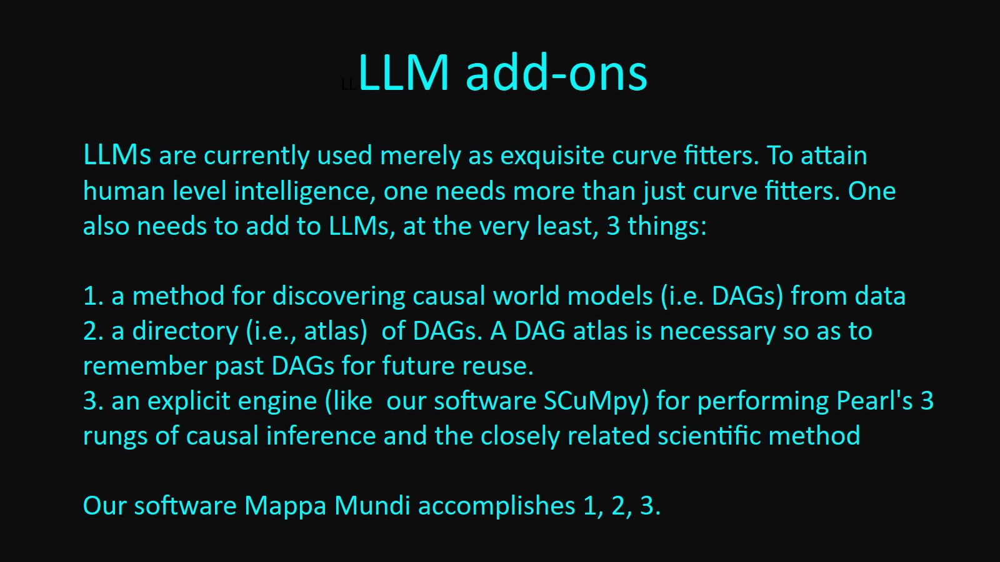
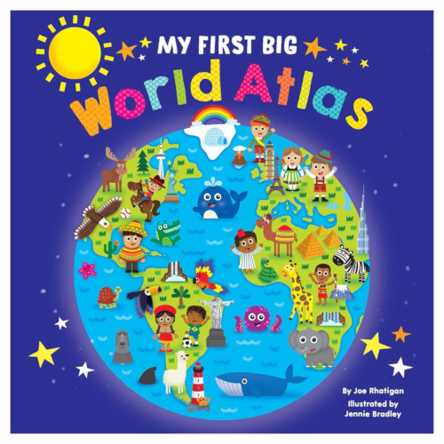

# Mappa_Mundi

Welcome to Mappa_Mundi (MM)!

MM is a method that combines seamlessly
Large Language Models (LLM)
and Causal Inference (CI).

The MM software does causal DEFT
(causal DAG Extraction From Text).
We store each extracted DAG in a separate file, and we put
all DAG files in a directory
that we call
a DAG Atlas.

I discuss the software in
detail in this white paper: 
* [Version 1](https://github.com/rrtucci/mappa_mundi/blob/master/white_paper/mappa_mundi.pdf)  
* [Version 2](https://github.com/rrtucci/mappa_mundi/blob/master/white_paper/mappa_mundi_V2.pdf)

